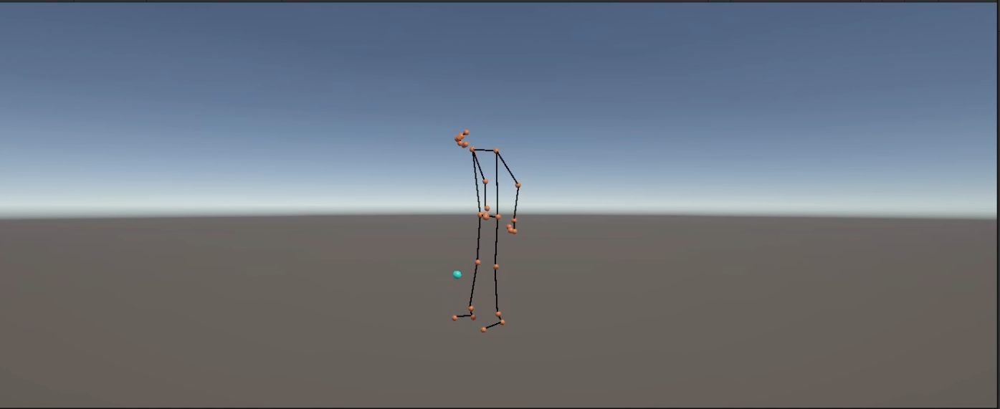

# Motion Capture System with Pose Detection and Ball Tracking

A Python-based motion capture system that uses computer vision to detect human pose and track a ball, generating data for use in Unity animations and visualizations. The project includes both the Python detection scripts and Unity C# scripts for rendering.




## 🪟 Overview

This project provides tools to:

1. Detect human pose keypoints using OpenCV and cvzone
2. Track a ball using YOLOv8 object detection
3. Export pose and ball position data to a text file for use in Unity or other 3D applications
4. Visualize the detection in real-time
5. Render the skeleton and ball animation in Unity

The system supports both real-time preview and offline processing of video files, with options for basic or advanced ball interpolation.

## 🗃️ Files

```bash
  git clone https://github.com/donsolo-khalifa/FootballKeyPointsExtraction.git
  cd FootballKeyPointsExtraction
  ```

### Project Structure

```text
FootballKeyPointsExtraction/
├── python                     # Motion capture & tracking
│   ├── main.py                # Real-time visualization
│   ├── motionCapture.py       # Basic capture → `AnimationFile.txt`
│   └── ballInterpolationMC.py # Two-pass ball interpolation
├── C#                         # Unity integration & rendering
│   ├── AnimationCode.cs       # Applies data to joints & ball
│   └── SkeletonRenderer.cs    # Draws skeleton lines
├── requirements.txt
└── .gitignore                 
```

### Python (Motion Capture)

- `main.py` - Real-time visualization of pose estimation and ball tracking
- `motionCapture.py` - Basic motion capture that processes video and saves keypoints to a text file
- `ballInterpolationMC.py` - Advanced motion capture with ball position interpolation for smoother animations

### Unity (Rendering)

- `AnimationCode.cs` - Script for reading animation data and applying it to skeleton and ball
- `SkeletonRenderer.cs` - Script for rendering the skeleton by drawing lines between joints

## 🛠️ Requirements

```bash
pip install -r requirements.txt
```

```
opencv-python
cvzone
ultralytics
tqdm
numpy
```

## 📋 Usage

### Real-time Preview

To preview the pose and ball detection in real-time:

```bash
python main.py
```

Press 'q' to exit the preview.

### Basic Motion Capture

For simple motion capture without ball interpolation:

```bash
python motionCapture.py
```

This will process the video file, detect pose keypoints and ball position, and save the data to `AnimationFile.txt`.

### Advanced Ball Interpolation

For motion capture with ball interpolation (smoother ball tracking):

```bash
python ballInterpolationMC.py
```

This uses a two-pass approach:

1. First pass detects all ball positions
2. Second pass interpolates missing positions and processes pose keypoints
3. Outputs combined data to `AnimationFile.txt`

## ℹ️ Output Format

The `AnimationFile.txt` contains comma-separated values for each frame:

- For each keypoint (33 keypoints from PoseDetector): `x,y,z`
- For the ball (as 34th joint): `x,y,z`

Coordinates are normalized:

- x and y values divided by 100
- z values divided by 300
- y-axis is inverted to match Unity coordinate system

# Unity Integration

The project includes ready-to-use Unity scripts for rendering the captured motion:

### Setting Up in Unity

1. Create a new Unity project (3D)
2. Import the `AnimationFile.txt` into your Unity project's Assets folder
3. Set up the hierarchy:

   - Create an empty GameObject as a parent and rename it to `Manager`
   - Create an empty GameObject as a parent and rename it to `Body`
   - Add 33 empty 3D objects (Spheres) as children of `Body` (one for each joint)
   - Create a 3D object (Sphere) as parent for the ball and rename it `Ball`
   - Create an empty GameObject as a parent and rename it to `SkeletonRenderer`


4. Add the scripts:
   - Add `AnimationCode.cs` to the `Manager` GameObject
   - Assign all 33 joint `3D objects (Spheres)` to the `Body` array in the Inspector
     > **Note:** Tip for mass assigning joints:
     > - Lock the Inspector window (click the lock icon in the top-right of the Inspector)
     > - Select all 33 joints (Spheres) in the Hierarchy by clicking the first one, then Shift+click the last one
     > - Drag the entire selection into the Body array field in the Inspector
     
     
     This will automatically populate all array elements in the correct order

   - Assign the ball Sphere to the `Ball` reference

5. For skeleton visualization:
   - Create a LineRenderer prefab with your desired material
   - Add `SkeletonRenderer.cs` to the `SkeletonRenderer` GameObject 
   - Assign the parent GameObject with 33 joints to the `Body` field
   - Assign your LineRenderer prefab to the `linePrefab` field

### How the Unity Scripts Work

#### AnimationCode.cs

- Reads the pose and ball data from `AnimationFile.txt`
- Applies positions to the 33 body joints and the ball
- Plays back the animation with a frame rate of approximately 30 FPS

#### SkeletonRenderer.cs

- Creates line renderers between connected joints
- Defines the skeletal structure using the MediaPipe 33-landmark model
- Updates the lines each frame to follow the joint positions

### Customization in Unity

- Adjust the `Thread.Sleep(30)` value in `AnimationCode.cs` to change animation speed
- Modify the `_connections` array in `SkeletonRenderer.cs` to change which joints are connected
- Customize the line appearance by changing the LineRenderer prefab properties

## 🚧 Customization

- For real-time webcam use, modify scripts to use `cv2.VideoCapture(0)` instead of `cv2.VideoCapture('vida.mp4')` 
- Change `video_path` in the scripts to use a different video file
- Adjust `BALL_CLASS_ID` if tracking a different object (32 is sports ball in COCO dataset)
- Modify scaling factors in the output section if needed for your specific Unity setup
- Set `MAX_FRAMES_TO_KEEP` in real-time applications to control how long a ball position is retained when detection fails


## 📝 Performance Notes

- `ballInterpolationMC.py` provides smoother ball tracking but is not suitable for real-time applications
- For real-time processing (like with a webcam), use `motionCapture.py` or implement simple interpolation with a single-pass approach
- YOLOv8 model size can be adjusted for performance vs. accuracy tradeoffs (n, s, m, l, x versions)

<!-- ## License

[MIT License](LICENSE) -->
